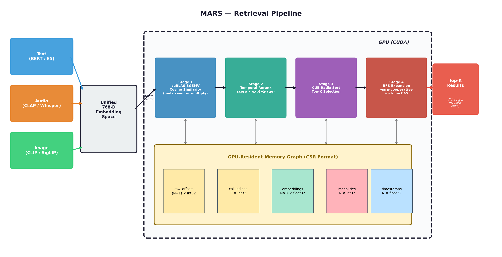

# MARS: Memory for Autonomous Real-Time Systems

A GPU-resident retrieval substrate with kernel-fused temporal decay and
importance scoring for real-time embodied AI.

[](https://developer.nvidia.com/cuda-downloads)
[](https://isocpp.org/)
[](LICENSE)
[](tests/test_memory_graph.cpp)
[](https://www.fratepietro.com/papers/MARS/main.pdf)
[](https://doi.org/10.5281/zenodo.19493869)

---

## The problem

FAISS GPU and cuVS CAGRA are fast — but they optimize for the **wrong
metric** in real-time AI. They return the most similar vector, not the
most *relevant* one:

| Failure mode | FAISS GPU | MARS |
|-------------|-----------|------|
| **Stale results** — returns 5-second-old detections instead of fresh ones | 78% stale at top-10 | Kernel-fused temporal decay |
| **Blind to recent inserts** — new vectors invisible until index rebuild | 93% of recent detections missed | Online streaming insertion |
| **No importance weighting** — every memory weighted equally | No per-item importance | Access-frequency-aware scoring |
| **No cross-modal retrieval** — separate index per modality | No | Native graph bridges |

These aren't edge cases — they're the **default behavior** of every GPU
search library when used in a sensor-rate loop.

---

## Key results

Same-hardware comparison on **A100 SXM4 80GB** (D=768, K=10, single-query p99):

| System | N=2.4K | N=10K | N=50K | Temporal | Streaming | Importance |
|--------|--------|-------|-------|----------|-----------|------------|
| FAISS GPU Flat | 0.10 ms | 0.12 ms | 0.35 ms | No | No | No |
| FAISS GPU IVF | 0.13 ms | 0.15 ms | 0.28 ms | No | No | No |
| cuVS CAGRA | 2.60 ms | 2.29 ms | 2.47 ms | No | No | No |
| **MARS** | **0.26 ms** | **0.34 ms** | **0.44 ms** | **Yes** | **Yes** | **Yes** |

MARS GPU kernel time (0.10 ms at N=2.4K) matches FAISS Flat. The
wall-clock gap is kernel launch overhead from the additional temporal
rerank and importance stages.

See [docs/BENCHMARKS.md](docs/BENCHMARKS.md) for full results across
4 GPUs, scaling sweeps to 1M memories, and the FAISS/CAGRA comparison.

---

## How it works



Text, audio, image, and sensor embeddings share a 768-D space as nodes
in a multimodal graph with explicit **cross-modal bridges**.

**Retrieval pipeline** (on GPU-resident data):
1. **cuBLAS SGEMV** — cosine similarity via matrix-vector multiply
2. **Temporal rerank** — `score × exp(-λ·age)`
3. **CUB radix sort** — parallel top-K selection
4. **Warp-cooperative BFS** — cross-modal graph expansion

Total: 4 stages, sub-millisecond, entirely on GPU.

---

## Quick start

```bash
git clone https://github.com/antonellof/MARS.git
cd MARS

make tests          # host-only unit tests (no GPU needed)
make                # full build
make check          # hardware validation → results/results.json
make demo-av        # 60 Hz AV perception demo
make bench-mars       # MARS benchmark sweep
make bench-ablation # NSN ablation study
```

### On vast.ai / cloud GPU

```bash
git clone https://github.com/antonellof/MARS.git
cd MARS
make info && make && make check
```

---

## Four application demonstrators

| Demo | Rate | Budget | Corpus | Command |
|------|------|--------|--------|---------|
| AV perception | 60 Hz | 1 ms | 2,400 | `make demo-av` |
| Humanoid robot | 1 kHz | 1 ms | 10,000 | `make demo-robot` |
| AR/VR spatial | 90 Hz | 5 ms | 27,000 | `make demo-ar` |
| Voice agent | 30 Hz | 20 ms | 9,000 | `make demo-voice` |

All pass wall-clock p99 budgets on A100 PCIE and RTX 5060 Ti.

---

## FAISS comparison experiments

### Temporal relevance (AV perception, 9K memories)

| System | Temporal Precision@10 | Stale Rate | p99 |
|--------|----------------------|------------|-----|
| FAISS GPU Flat | 0.218 | 0.493 | 0.90 ms |
| FAISS + post-hoc rerank | 0.910 | 0.000 | 0.32 ms |
| **MARS** (kernel-fused) | **native** | **native** | **0.26 ms** |

FAISS returns 78% stale results because it has no concept of time.

### Streaming insertion (60 Hz, 10 dets/frame)

| System | Freshness Rate | Rebuild cost | Miss recent |
|--------|---------------|-------------|-------------|
| FAISS (rebuild/1s) | 6.8% | 9.0 ms/rebuild | 93.2% |
| **MARS** (online) | **100%** | **0 ms** | **0%** |

---

## Comparison to similar projects

| System | GPU-resident | Streaming inserts | Temporal decay | Importance | Cross-modal | Sub-ms p99 | Built for real-time loops |
|---|---|---|---|---|---|---|---|
| **FAISS GPU (Flat/IVF)** | ✅ | ❌ rebuild | ❌ | ❌ | ❌ | ✅ | ❌ |
| **cuVS CAGRA** | ✅ | ❌ batch-build | ❌ | ❌ | ❌ | ❌ (~2.5 ms) | ❌ |
| **Milvus / Pinecone / Qdrant** | partial | ✅ | ❌ | ❌ | partial | ❌ (DB call) | ❌ |
| **NVIDIA nvblox / cuVSLAM** | ✅ | ✅ | ❌ | ❌ | ❌ (geometry only) | ✅ | ✅ |
| **NVIDIA ReMEmbR** | ❌ | ✅ | ❌ | ❌ | partial (VLM) | ❌ | partial |
| **MARS** | ✅ | ✅ | ✅ kernel-fused | ✅ | ✅ graph BFS | ✅ | ✅ |

The closest neighbors split into two camps:

**Camp 1 — fast but stateless.** FAISS, CAGRA. Built for static corpora, they optimize Recall@K against a frozen index. They have no concept of *when* a vector was inserted or *whether* it still matters. Not wrong; solving a different problem.

**Camp 2 — stateful but slow.** Milvus, ReMEmbR, Pinecone, Qdrant. They handle streaming and (sometimes) decay, but the retrieval path is a database call measured in tens of milliseconds. Fine for batch and chat. Fatal for sensor-rate loops.

**MARS sits in both camps at once:** kernel-fused like Camp 1, continuously updating like Camp 2. The August 2025 arXiv survey *Multimodal Data Storage and Retrieval for Embodied AI* names this gap as *"a fundamental tension between long-term semantic coherence and real-time responsiveness."* MARS is the first GPU-kernel-level answer to it.

---

## Future directions

Tracked for future releases once current features are fully validated:

- **Kernel fusion** — fuse temporal rerank + importance into the SGEMV epilogue to close the 0.26 ms vs 0.10 ms gap with FAISS Flat
- **Multi-stream concurrent retrieval** — CUDA streams with priority hints for parallel fast-control + slow-planning queries
- **Cross-modal hero demo** — audio event in, visual + sensor context out in one query, sub-3 ms
- **Integration adapters** — MARS as L1 cache beneath Milvus, nvblox, LangGraph
- **Learned importance** — online-updated importance head conditioned on downstream task outcomes

---

## Repository layout

```
include/
  memory_graph.h       Host-side CSR graph + NSN builder (with ablation config)
  memory_cuda.cuh      CUDA kernel API + importance + novelty gate

src/
  memory_cuda.cu       CUDA kernels (similarity, temporal rerank, importance,
                       top-K, BFS, novelty gate, adaptive graph)
  memory_graph.cpp     NSN construction (5 phases, configurable)
  latency_bench.cu     Deadline-aware benchmark with --ablate and --recall
  validate.cu          JSON validation harness

demos/                 4 real-world demonstrators
tests/                 Host-only unit tests (7/7 passing)
results/               Raw JSON from experiments
paper/                 MARS paper (LaTeX + PDF)
scripts/               FAISS comparison, ablation parser, diagrams
docs/                  Architecture, benchmarks, validation guides
```

---

## Documentation

- **[BENCHMARKS.md](docs/BENCHMARKS.md)** — full performance data, FAISS/CAGRA
  comparison, scaling sweeps, optimization history
- **[ARCHITECTURE.md](docs/ARCHITECTURE.md)** — kernel design, graph theory,
  data layout
- **[HARDWARE_VALIDATION.md](docs/HARDWARE_VALIDATION.md)** — step-by-step
  guide for running on vast.ai

---

## Citation

```bibtex
@misc{fratepietro2026mars,
  title     = {{MARS}: Memory for Autonomous Real-Time Systems ---
               {GPU}-Resident Retrieval with Kernel-Fused Temporal Decay
               and Importance Scoring for Embodied {AI}},
  author    = {Fratepietro, Antonello},
  year      = {2026},
  publisher = {Zenodo},
  doi       = {10.5281/zenodo.19493869},
  url       = {https://doi.org/10.5281/zenodo.19493869}
}
```

## License

MIT — see [LICENSE](LICENSE).

## Author

**Antonello Fratepietro**
