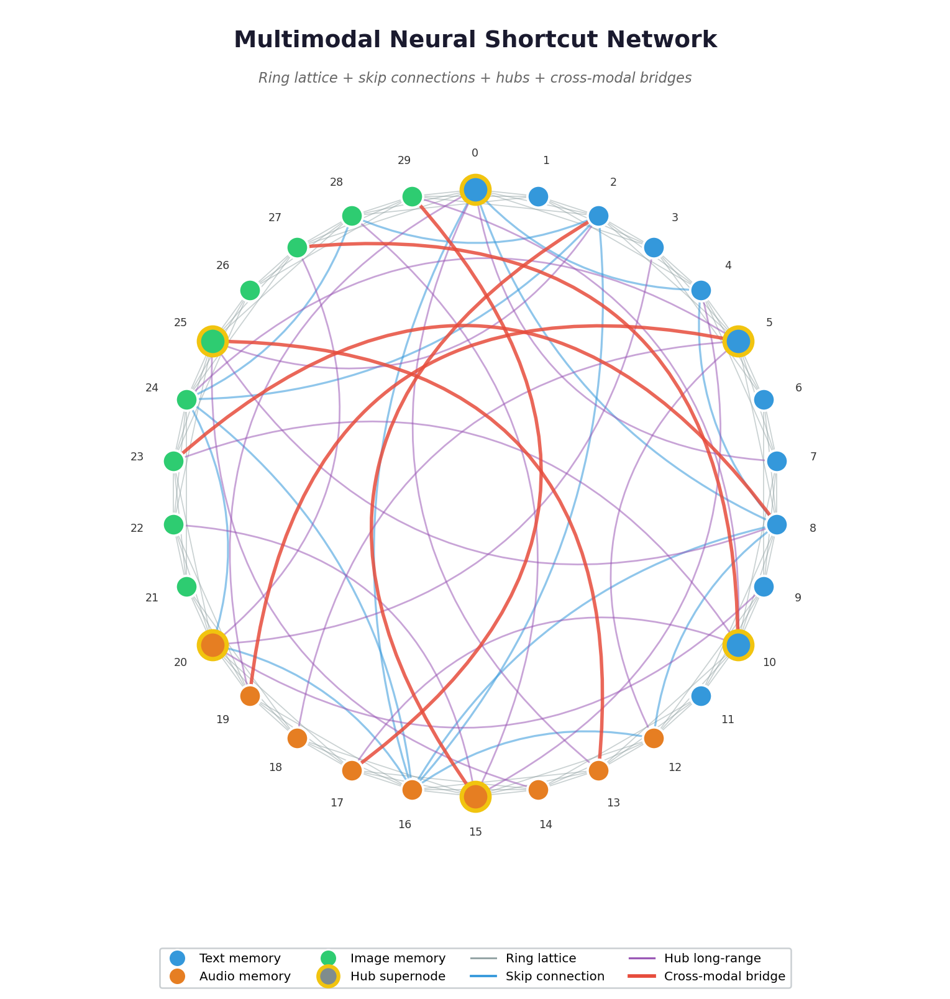
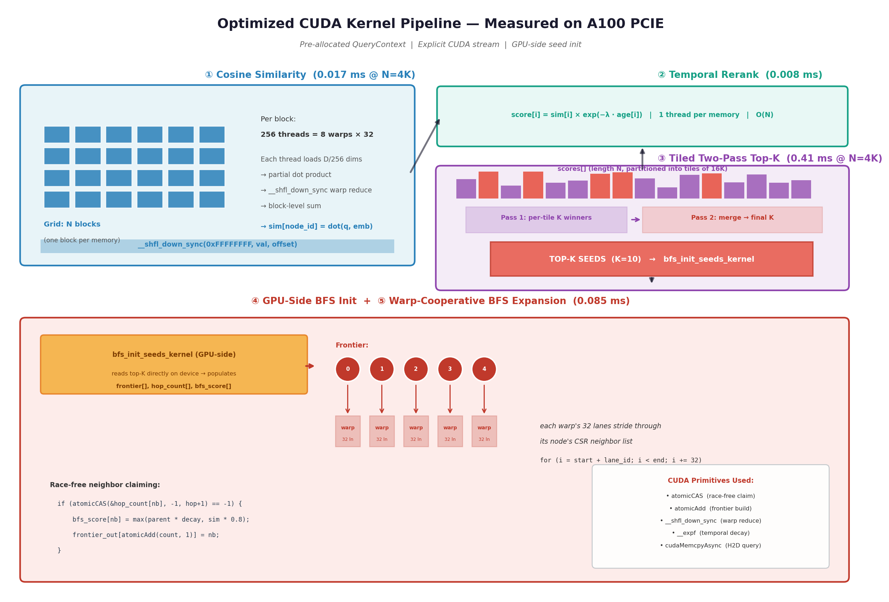

# Architecture Deep Dive

This document explains the internal design of MARS: the CSR data layout,
the Neural Shortcut Network topology, and the CUDA kernels that make up
the retrieval pipeline.

This document
describes the core architecture and the current
pipeline. For a higher-level overview, start
with the [README](../README.md). For the full academic treatment, see the
[arXiv paper](../paper/main.pdf).

---

## 1. Data layout

The memory graph is stored in **Compressed Sparse Row (CSR)** format — the
standard GPU-friendly representation for sparse graphs. Five device arrays
hold the complete state:

| Array          | Size     | Type     | Purpose                                        |
|----------------|----------|----------|------------------------------------------------|
| `row_offsets`  | N+1      | int32    | Prefix-sum of node degrees                     |
| `col_indices`  | E        | int32    | Neighbor node IDs (sorted per row)             |
| `embeddings`   | N × D    | float32  | L2-normalized embedding vectors                |
| `modalities`   | N        | int32    | Modality tag: 0=text, 1=audio, 2=image         |
| `timestamps`   | N        | float32  | Memory creation time (for temporal decay)      |

For N = 1 million memories with D = 768 and average degree 12:

- `row_offsets`: 4 MB
- `col_indices`: 48 MB
- `embeddings`: 3.07 GB ← dominant cost
- `modalities`: 4 MB
- `timestamps`: 4 MB
- **Total**: ≈3.13 GB

This fits comfortably in a 40 GB A100 with room for ~12M memories total.

## 2. The Neural Shortcut Network

The graph topology is constructed in five phases. The first four build a
unimodal NSN; the fifth phase — cross-modal bridges — is specific to this
project.

### Phase 1: Ring lattice

Every node is connected to its k/2 nearest neighbors on each side around a
circular arrangement. For k=6, each node has 6 local neighbors.

```
    ... ← 2 — 3 — 4 — 5 — 6 ← ...     (node 4 connects to 1,2,3,5,6,7)
```

This provides **high local clustering** — the property that gives GPU BFS
good cache behavior, because frontier nodes tend to share cache lines.

### Phase 2: Hierarchical skip connections

For each level ℓ = 1, 2, ... log₂(N), add edges at stride 2^ℓ:

```
  lvl=1 (step 2):  0→2, 2→4, 4→6, ...
  lvl=2 (step 4):  0→4, 4→8, 8→12, ...
  lvl=3 (step 8):  0→8, 8→16, ...
```

This guarantees **logarithmic diameter**: from any node, there's a path to
any other node with at most log₂(N) hops.

### Phase 3: Hub supernodes

Every √N-th node becomes a "hub" with extra log(N)/2 random long-range edges.
Hubs act as high-degree relays — their role in BFS is to broadcast the
frontier across the graph quickly, analogous to thalamic relay nuclei in
biological neural networks.

### Phase 4: Small-world rewiring

With probability p ≈ 0.15, each local edge is rewired to a random distant
node. This is the classic Watts-Strogatz trick: it introduces random shortcuts
that drastically reduce average path length while preserving local clustering.

### Phase 5: Cross-modal bridges (the key innovation)

For every memory node, add one edge to a randomly-chosen memory of **each
other modality**. This guarantees:

```
  ∀ node n, ∀ modality m:  ∃ neighbor of n with modality m
```

A text query's BFS expansion therefore reaches audio and image memories in a
single hop, without any cross-modal search logic. Note that this guarantees
*structural* reachability — whether the reached cross-modal neighbors are
semantically relevant depends on the quality of the shared embedding space
(see the paper's failure modes analysis).



## 3. The CUDA kernels

The retrieval pipeline uses four kernel stages. The current version
replaces the similarity kernel with cuBLAS SGEMV and the top-K kernel
with CUB DeviceRadixSort, while keeping the temporal rerank and BFS
kernels.

### Kernel 1: `cosine_similarity_kernel`

**Grid**: N blocks (one per memory node)
**Block**: 256 threads = 8 warps

Each block computes the dot product between the query vector and one
memory's embedding. The 256 threads cooperate:

1. Each thread accumulates a partial dot product across D/256 dimensions
2. Warp-level reduction via `__shfl_down_sync` gives one scalar per warp
3. Block-level reduction across warps via shared memory gives the final score

Because embeddings are L2-normalized at insertion, cosine similarity =
dot product. This sidesteps the per-query normalization cost.

The modality filter is implemented as an early exit: if the node's modality
doesn't match the filter, thread 0 writes -∞ and the block returns, avoiding
the embedding load entirely.

**Memory pattern**: Coalesced. Each warp reads 32 contiguous floats from the
embedding, which is a single 128-byte transaction on A100.

### Kernel 2: `temporal_rerank_kernel`

**Grid**: ⌈N / 256⌉ blocks
**Block**: 256 threads (one thread per memory)

Embarrassingly parallel. Computes:

```
final_score[i] = similarity[i] × exp(-λ × (query_timestamp - memory_timestamp[i]))
```

The `__expf` intrinsic is the fast hardware exponential — about 4x faster
than `exp()` on A100, with slightly relaxed accuracy. Sub-microsecond total
latency at any corpus size we care about.

This is where "automatic forgetting" happens: older memories get
exponentially down-weighted, so they lose to recent memories of similar
similarity.

### Kernel 3: `top_k_kernel`

**Grid**: 1 block
**Block**: 256 threads

Each thread maintains its own local top-K buffer in registers (K ≤ 64), then
merges via shared memory, then thread 0 does the final K-way selection.

An optimization round added a **tiled two-pass variant** (`top_k_tiled_pass1` +
`top_k_tiled_pass2`) that splits the scores array into tiles of 16K elements,
computes local top-K per tile in parallel, then merges. The single-block path
is used when N fits in one tile (≤16K); the tiled path activates above that.
At the target workload sizes (2K–10K), the single-block path is faster.

### Kernel 4: `bfs_expand_kernel` (the interesting one)

**Grid**: ⌈frontier_size / 8⌉ blocks (with 8 warps per block)
**Block**: 256 threads = 8 warps

This is where the NSN topology earns its keep. **One warp per frontier
node.** The 32 lanes of each warp cooperatively scan their assigned node's
neighbor list using stride-32 access:

```cuda
// Each lane processes every 32nd neighbor
for (int32_t i = start + lane_id; i < end; i += 32) {
    int32_t neighbor = col_indices[i];

    // Atomic claim: only first thread to reach this neighbor wins
    int32_t old = atomicCAS(&hop_count[neighbor], -1, current_hop + 1);
    if (old == -1) {
        // Propagate score with hop decay
        float parent_sc = bfs_score[node];
        float own_sim   = sim_scores[neighbor];
        bfs_score[neighbor] = fmaxf(parent_sc * hop_decay, own_sim * 0.8f);

        int32_t pos = atomicAdd(frontier_count, 1);
        frontier_out[pos] = neighbor;
    }
}
```

**Why this pattern works**:

1. **Coalesced loads**: CSR stores neighbors contiguously, so `col_indices[start + lane_id]`
   is a perfect 128-byte transaction
2. **Race-free claiming**: `atomicCAS` ensures each neighbor is claimed
   exactly once, even when multiple warps race to visit it
3. **Lock-free frontier construction**: `atomicAdd` gives each claimed
   neighbor a unique slot in `frontier_out`
4. **Score propagation**: BFS score is the max of (parent score × hop decay)
   and (own similarity × 0.8), so both proximity to seeds AND direct
   similarity matter

The hop count and score arrays are recycled across waves — we just swap
`frontier_in` and `frontier_out` pointers.

### Additional optimizations

The device-driven pipeline adds two new kernels:

- **`bfs_expand_device_driven_kernel`**: Same traversal logic as the original
  BFS kernel, but reads `frontier_count` directly from device memory instead
  of requiring a host readback between hops. The host launches a fixed-size
  grid covering the worst-case frontier; excess warps exit immediately. This
  eliminates `cudaStreamSynchronize` calls between BFS hops.

- **`compact_results_kernel`**: After BFS completes, scans `hop_count[]` and
  compacts only visited nodes (typically ~50–100 out of N) into a dense
  `CompactResult` array via `atomicAdd`. This replaces the O(N) D2H copy of
  three full arrays with an O(visited) copy of one compact struct.

- **`keepalive_kernel`**: A 1-thread, 1-block no-op kernel launched every 2ms
  between frames at low sensor rates (≤60 Hz) to prevent the GPU from dropping
  to a lower clock state.



## 4. Why this is fast

Three properties compound:

**(a) Data never leaves the GPU.** CPU-first memory systems pay 5–20 ms per
query on network round-trips alone (embedding call, vector DB query, metadata
join). Here, the query vector arrives once and the result leaves once.
Everything in between runs on HBM at 1.5+ TB/s.

**(b) Every kernel is bandwidth-aligned.** Similarity is a coalesced dot
product. BFS is a stride-32 CSR scan. Top-K fits in shared memory. Rerank is
a single pointwise pass. None of them hit the pointer-chasing patterns that
kill HNSW and other CPU-tuned indexes on GPU.

**(c) The NSN topology keeps BFS bounded.** From the top-10 seeds, a 2-hop
expansion reaches at most K × average_degree² ≈ 10 × 121 ≈ 1,210 nodes —
regardless of total corpus size. That's why the BFS latency stays near
0.1 ms from N=1K to N=16K.

## 5. What we give up

1. **Not persistent.** Data lives in VRAM. A crash loses everything unless
   you snapshot to disk manually.
2. **Single-GPU ceiling.** ~12M memories on a 40 GB A100, ~24M on an 80 GB
   H100. Beyond that, multi-GPU sharding is needed.
3. **No transactions.** There's no equivalent of Postgres ACID. Concurrent
   inserts are possible but deletion requires tombstoning + periodic
   compaction.
4. **GPU-bound.** Only runs on NVIDIA GPUs with compute capability 7.0+.
   No CPU fallback path. This is deliberate — a CPU fallback would imply
   that the system can degrade gracefully, which is incompatible with
   deterministic latency guarantees.

All numbers are measured on an NVIDIA A100X (80 GB, CUDA 12.0). See
`results/` for raw JSON data.

These are the right trade-offs for a **real-time retrieval substrate** —
the memory layer inside an AV perception stack, a robot controller, an AR
headset, or a voice agent. They are the wrong trade-offs for a primary
system of record, which is why this project is meant to sit *alongside* a
traditional persistence layer, not replace it.
